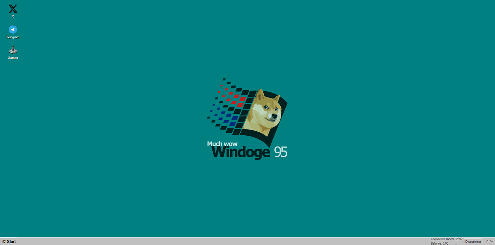

# 🪟 Windoge95

**A retro-themed Ethereum dApp inspired by Windows 95 - built with Hardhat, React, and smart contracts.**



---

## 🚀 Overview

**Windoge95** is a modern Ethereum-based dApp that merges Web3 development with 90s nostalgia. Featuring a modular codebase, smart contracts via Hardhat, and a fully interactive React95 interface, it’s designed for developers who love building weird, playful, and open-source blockchain applications.

---

## 🛠 Features

* 🧠 **Smart Contracts** — Solidity + Hardhat setup, ready for forking or expansion.
* 🖥️ **Frontend** — Built with [React95](https://github.com/react95-io/React95) for that iconic retro feel.
* ⚙️ **Modular Codebase** — Easily extendable with clear separation between contracts, scripts, and UI.
* 💻 **One-Click Dev Setup** — Fast to spin up locally or deploy to a testnet.
* 😎 **Fun as Hell** — It's Windows 95 on the blockchain. Need we say more?

---

## 📂 Project Structure

```text
windoge95/
├── contracts/          # Solidity contracts
├── scripts/            # Hardhat deployment scripts
├── frontend/           # React95-based frontend
├── test/               # Contract tests
├── hardhat.config.js   # Hardhat configuration
└── README.md           # You're here
```

## 🔗 Inspiration

This project draws heavy inspiration from [React95](https://github.com/react95-io/React95)

Huge thanks to the React95 team for setting the standard — and for fostering a positive, collaborative, and open-source-first spirit that made projects like this possible.

---

## 📜 License

MIT — feel free to fork, remix, or meme your way forward.

---

## 🙋‍♂️ Author

Made with 💾 by [@DeFi_Vandelay](https://twitter.com/DeFi_Vandelay)

---


